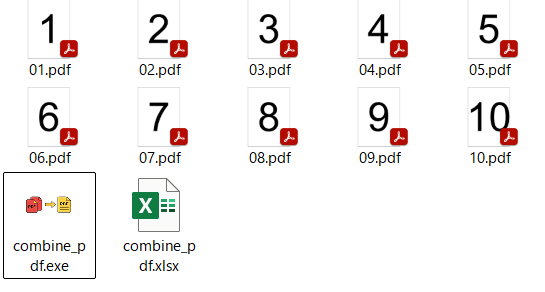
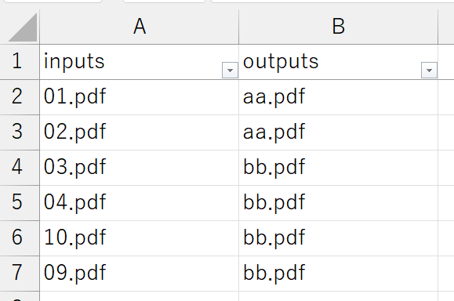
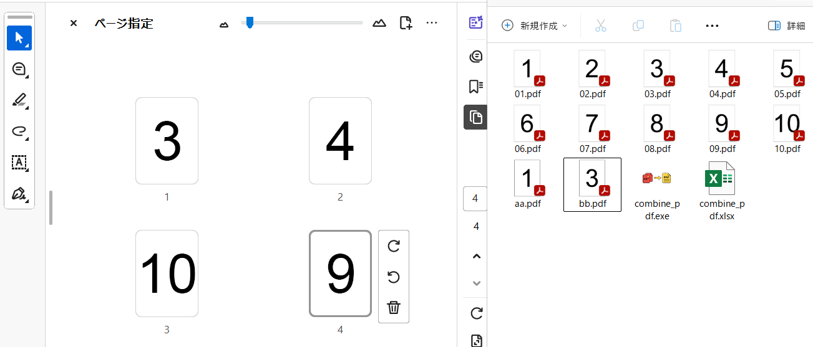

# combine_pdfの使い方

# How to use combine_pdf

## 免責事項

## Disclaimer

使用による不利益への責任は負えませんので，自己責任でご利用ください． 不具合がありましたら，松村([matutosi\@gmail.com](mailto:matutosi@gmail.com){.email})にご連絡ください．

I am not responsible for any disadvantages caused by the use of this software, so please use this at your own risk. If you have any problems, please contact Matsumura ([matutosi\@gmail.com](mailto:matutosi@gmail.com){.email}).

## 導入方法

## Installation

combine_pdf.exe と combine_pdf.xlsx を同じディレクトリに保存します．

copy combine_pdf.exe and combine_pdf.xlsx to the same directory.

## 使い方

## How to use

### Combine PDF

1.  結合するPDFファイルを combine_pdf.exe と同じディレクトリに保存．\
    
2.  combine_pdf.xlsx のinputs列とoutputs列にファイル名を入力．
    -   inputs: 入力ファイル名
    -   outputs: 出力ファイル名
    -   outputs列のファイル名が同じものを上から順に結合． \
    
3.  combine_pdf.exe をクリックして実行．

combine_pdf.xlsx が次のように入力されており，[01.pdf, 02.pdf, 03.pdf, 04.pdf, 10.pdf, 09.pdf]の7つのPDFファイルがあるとき， 01.pdf と 02.pdf を結合した aa.pdf および 03.pdf と 04.pdf と 10.pdf と 09.pdf を結合したbb.pdf が生成されます．

| inputs | outputs |
|--------|---------|
| 01.pdf | aa.pdf  |
| 02.pdf | aa.pdf  |
| 03.pdf | bb.pdf  |
| 04.pdf | bb.pdf  |
| 10.pdf | bb.pdf  |
| 09.pdf | bb.pdf  |

This is how to use conbime_pdf.py. How to use other tools are almost similar.

1.  Save the PDF files to be combined in the same directory with combine_pdf.exe.\
    
2.  Enter the file names in the inputs and outputs columns of combine_pdf.xlsx.
    -   inputs: input file names\
    -   outputs: output file name\
    -   The files with the same Input files will be combined according the name in the outputs column from the top. \
    
3.  Click on combine_pdf.exe to run.

If combine_pdf.xlsx is entered as follows and there are four PDF files [01.pdf, 02.pdf, 03.pdf, 04.pdf, 10.pdf, 09.pdf], then aa.pdf is generated by combining 01.pdf and 02.pdf, and bb.pdf by combining 03.pdf, 04.pdf, 10.pdf and 09.pdf.

| inputs | outputs |
|--------|---------|
| 01.pdf | aa.pdf  |
| 02.pdf | aa.pdf  |
| 03.pdf | bb.pdf  |
| 04.pdf | bb.pdf  |
| 10.pdf | bb.pdf  |
| 09.pdf | bb.pdf  |

