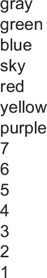
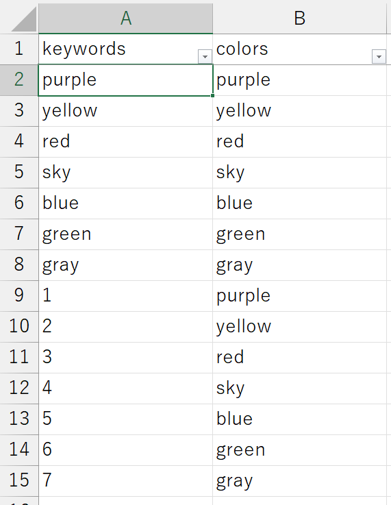
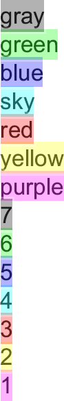

# highlight_pdfの使い方

# How to use highlight_pdf

## 免責事項

## Disclaimer

使用による不利益への責任は負えませんので，自己責任でご利用ください． 不具合がありましたら，松村([matutosi\@gmail.com](mailto:matutosi@gmail.com){.email})にご連絡ください．

I am not responsible for any disadvantages caused by the use of this software, so please use this at your own risk. If you have any problems, please contact Matsumura ([matutosi\@gmail.com](mailto:matutosi@gmail.com){.email}).

## 導入方法

## Installation

highlight_pdf.exe と highlight_pdf.xlsx を同じディレクトリに保存します．

copy highlight_pdf.exe and highlight_pdf.xlsx to the same directory.

## 使い方

1.  強調表示するPDFファイル(複数ファイル可)を hightligt_pdf.exe と同じディレクトリに保存．\
    

2.  hightligt_pdf.xlsx のkeywords列とcolors列に入力．

    -   keywords: 強調表示する文字列
    -   colors: 強調表示で使う色(以下が利用可能)
        -   purple: 紫
        -   yellow: 黄
        -   red : 赤
        -   sky : 空
        -   blue : 青
        -   green : 緑
        -   gray : 灰\
            

3.  hightligt_pdf.exe をクリックして実行．\
    

** 画面上では繋がって見える文字列でも，PDFの中ではスペースが入っていたり，離れている場合は強調表示がうまくいきません．文字列を変えて試してください． **

## How to use

1.  Save pdf file(s) to be hightligted in the same directory with hightligt_pdf.exe.\
    

2.  Enter the keywords and colors columns of hightligt_pdf.xlsx.

    -   keywords: strings to be hightligted
    -   colors: color name (can use the color name as below)
        -   purple
        -   yellow
        -   red
        -   sky
        -   blue
        -   green
        -   gray\
            

3.  Click on hightligt_pdf.exe to run.\
    

** Highlighting does not work when strings are splited by space or others, even if it appears to be connected on screen. Try using a different strings. **

